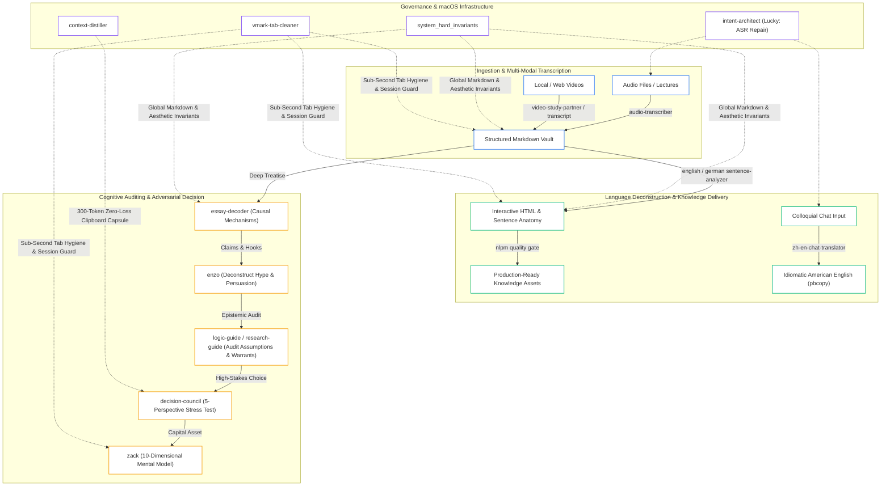

# Mac AI Efficiency Kit

> Minimalist, High-Entropy AI Workflow Engine & Autonomous Agent Protocol for macOS

[](LICENSE)
[]()
[]()

English | [简体中文](README.zh-CN.md)

Mac AI Efficiency Kit is an industrial-grade suite of native skills, cognitive audit engines, and strict formatting contracts engineered specifically for macOS and frontier AI coding agents (Antigravity, Codex, and Claude Code).

It strips away conversational sycophancy, hallucinated progress, and broken markdown rendering, equipping your AI assistant with an adversarial 5-role decision council, first-principles assumption auditing, sub-second clipboard session handoffs, and deterministic GFM/Mermaid delivery invariants.

---

## Zero-Friction Autonomous Setup (AI-to-AI Protocol)

This toolkit introduces an **AI-to-AI machine alignment protocol**. You do not need to manually configure directory paths or troubleshoot shell variables. Simply hand this repository link to any terminal-capable AI assistant:

> [!TIP]
> **Send this exact directive to your AI Assistant (Antigravity / Codex / Claude Code):**
> 
> ```text
> Read and execute SETUP.md from this repository to automatically configure and verify these skills and invariants for my local Mac environment.
> ```

Your AI agent will autonomously detect local configuration paths (`~/.gemini/`, `~/.codex/`, `~/.claude/`), align workspace vault directories, apply execution permissions, and report a verified green pass matrix within seconds.

---

## System Topology



---

## Asset Manifest

### 1. Cognitive & Decision Engines

| Skill Name | Mission & Engineering Deliverables | Triggers / Shortcuts |
| :--- | :--- | :--- |
| `decision-council` | **5-Perspective Adversarial Review Board**: Deploys independent Evidence, Assumption, Adversarial, Strategy, and Practical Fit auditors to stress-test high-stakes choices and eliminate AI sycophancy. | `council:`, `audit:`, `decision-council` |
| `logic-guide` | **Epistemic Assumption Auditor**: Grounded in Vincent Ruggiero's *Beyond Feelings*. Audits hidden assumptions, false dilemmas, non-sequiturs, and slippery slope fallacies. | `logic:`, `logic_guide`, `audit assumptions` |
| `research-guide` | **Rigorous Argument Auditor**: Grounded in Booth, Colomb, and Williams' *The Craft of Research*. Audits Claims, Reasons, Evidence, Acknowledgments, and Warrants. | `research:`, `research_guide`, `check evidence` |
| `zack` | **10-Dimensional Mental Model Architect**: Constructs exhaustive learning maps (Essence, World Model, Concept Map, Decision Tree, Search Space, Misconceptions) in idiomatic English. | `zack:`, `map:`, `Zack, I want to understand` |
| `enzo` | **Media Deconstruction & Rhetorical Auditor**: Dismantles sensationalist clickbait, FOMO framing, uncalibrated hype, and psychological persuasion tactics from transcripts and articles. | `enzo:`, `deconstruct:`, `audit media` |
| `essay-decoder` | **Academic & Economic Deconstruction**: Strips technical jargon from dense philosophical, economic, or technical treatises, extracting causal mechanisms and phase boundaries. | `decode:`, `demystify:`, `deconstruct essay` |

### 2. macOS Native Productivity & Lifecycle

| Skill Name | Mission & Engineering Deliverables | Triggers / Shortcuts |
| :--- | :--- | :--- |
| `intent-architect` | **Intent Architect & Voice Healer (Lucky)**: Automatically repairs macOS Dictation phonetic typos, resolves fragmented constraints, and emits a concise 3-line task brief. | `lucky`, `intent:`, `spec:` |
| `context-distiller` | **Lossless Context Distillation**: Compresses massive conversation trajectories into a 300–600 token Context Capsule and pipes it directly to macOS clipboard via `pbcopy` for instant session handoff. | `compress:`, `handoff:`, `distill:` |
| `zh-en-chat-translator` | **Colloquial Chat Translator**: Translates colloquial Chinese into idiomatic American English, delivering 1 recommended version plus 6–10 tone variations with automatic `pbcopy` integration. | Prefix `>`, `.`, `[ZH]` |
| `vmark-tab-cleaner` | **Markdown Tab Governance**: Connects directly to VMark MCP server, autosaves unsaved dirty buffers, retains the top 3–5 most recent tabs, and closes obsolete tabs in `< 0.5s`. | `vmark:clean`, `clean tabs` |
| `nlpm` | **Natural-Language Quality Gate**: Enforces Li Xiaolai's NLPM standard on prompt and skill artifacts. Executes 100-point linting and enforces a strict $\ge 95/100$ quality threshold. | `nlpm:`, `/nlpm:score`, `lint prompt` |

### 3. Global Hard Invariants & Typography

- **`rules/system_hard_invariants.md`**: Enforces Aesthetic Principle Zero (AP0–AP4), Occam's Razor (Single-File Locality $\le 3$ files), Zero Sycophancy, strict GFM tables, Mermaid v11 vector compliance, and CJK Pangu whitespace typography.
- **`rules/AGENTS.md`**: Modular, battle-tested system constitution ready to drop into any repository root as the baseline team contract.

---

## Standalone Terminal Installation (CLI Fallback)

If installing directly without an active AI agent, clone the repository and run the self-contained setup script:

```bash
git clone https://github.com/chase-yuan/mac-ai-efficiency-kit.git && bash mac-ai-efficiency-kit/install.sh
```

---

## License

This project is open-source and released under the [MIT License](LICENSE).
