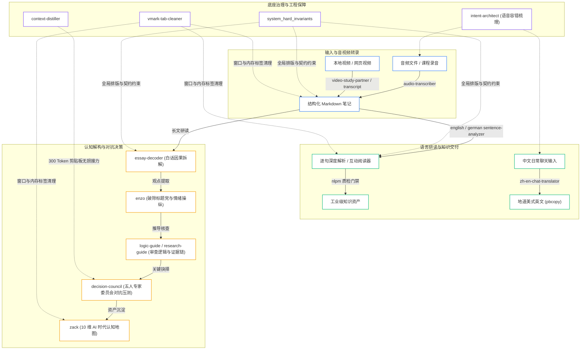

# Mac AI Efficiency Kit

> Minimalist, High-Entropy AI Workflow Engine & Autonomous Agent Protocol for macOS

[](LICENSE)
[]()
[]()
[]()

Mac AI Efficiency Kit 是一套专为 macOS 打造的原生 AI 技能与排版硬规范，全面适配 Antigravity、Codex 与 Claude Code。本套件彻底剔除 AI 的谄媚废话与排版乱码，为你的本地 AI 注入五人对抗性决策委员会、逻辑假设审计、剪贴板无损接力以及严谨的 GFM/Mermaid 交付契约。

---

## 零摩擦 AI 自适应安装 (Zero-Friction AI Installation)

本套件采用 **AI-to-AI 机器对齐协议**。无需手动克隆配置或排查环境变量，只需将本仓库地址交付给任意能够执行终端或文件操作的 AI 助手：

> [!TIP]
> **对你的 AI 助手（Antigravity / Codex / Claude Code）直接发送：**
> 
> ```text
> 请阅读并执行本仓库中的 SETUP.md，把其中的技能与排版规范全自动安装部署到我当前的 Mac 环境中。
> ```

AI 将自主探测本地环境路径（`~/.gemini/`、`~/.codex/`、`~/.claude/`）、对齐工作区目录并执行物理验证。

---

## 架构拓扑 (System Topology)



---

## 资产清单 (Asset Manifest)

### 1. 高阶认知与决策智囊 (Cognitive & Decision Engine)

| 技能名称 | 核心职责与工程交付标准 | 触发前缀 / 快捷指令 |
| :--- | :--- | :--- |
| `decision-council` | **五人独立决策委员会**：由事实核查员、前提审查员、反向辩护员、战略分析员与现实适配员组成，对高风险决策与 AI 建议执行去迎合（Anti-sycophancy）对抗性压测。 | `council:`、`audit:`、`决策委员会` |
| `logic-guide` | **底层逻辑与假设质检官**：基于《超越感觉》（Beyond Feelings）方法论，冷酷审计推论中的隐藏假设、因果断裂、虚假对立与滑坡谬误。 | `logic:`、`逻辑审查`、`找漏洞` |
| `research-guide` | **学术论证严谨性顾问**：基于《研究是一门艺术》（The Craft of Research），系统性核验主张（Claims）、理由（Reasons）、证据（Evidence）与正当理由（Warrants）。 | `research:`、`研究顾问`、`证据核查` |
| `zack` | **AI 时代全景认知地图架构师**：无论输入语种，始终以地道英文构建 10 维心智认知地图（世界模型、决策模型、本质机理、最小心智模型与认知误区）。 | `zack:`、`map:`、`Zack，我想了解` |
| `enzo` | **媒体批判与观点打假官**：深度解构社交媒体与爆款文章，拆解标题党情绪钩子、炒作话术、伪因果与心理操纵，重构客观概率边界。 | `enzo:`、`打假`、`媒体批判` |
| `essay-decoder` | **深度硬核长文白话拆解器**：将复杂的学术论文、经济学理论与技术专著剥离术语外壳，提炼底层第一性原理、因果机制与边界条件。 | `decode:`、`通俗解读`、`白话拆解` |

### 2. Mac 原生交互与生产力 (Mac Native Productivity)

| 技能名称 | 核心职责与工程交付标准 | 触发前缀 / 快捷指令 |
| :--- | :--- | :--- |
| `intent-architect` | **意图架构大管家 (Lucky)**：针对 macOS 语音听写与拼音流输入的同音错别字进行底层自愈，合并碎片约束，输出极简 3 行确定性任务简报。 | `lucky`、`intent:`、`大管家` |
| `context-distiller` | **上下文无损蒸馏与接力胶囊**：将超长对话上下文浓缩提纯为 300–600 Token 的状态胶囊，通过 `pbcopy` 静默写入系统剪贴板，支持跨窗口秒级接力。 | `compress:`、`handoff:`、`换窗口` |
| `zh-en-chat-translator` | **中英日常口语翻译器**：将中文口语即时意译为自然美式英语，提供 1 款推荐版 + 6–10 种语调变体与情境提示，推荐版自动吸入系统剪贴板。 | 前缀 `>`、`.`、`【中文】` |
| `vmark-tab-cleaner` | **Markdown 编辑器标签治理**：直连 VMark 官方 MCP 服务，自动存盘脏标签，平滑保留最近修改的 3–5 个窗口，秒级消除视觉噪音与内存泄露。 | `清理vmark`、`关掉多余窗口` |
| `nlpm` | **李笑来自然语言编程质检门禁**：对任何 Prompt、Skill 或 Agent 规范执行 100 分制静态代码质检，拦截模糊量词与无效修饰，守护 95+ 分数门禁。 | `nlpm:`、`/nlpm:score`、`提示词质检` |

### 3. 全局规范与排版硬契约 (Global Rules & Aesthetic Invariants)

- **`rules/system_hard_invariants.md`**：强制 AI 严格恪守美学第零原则（AP0–AP4）、奥卡姆剃刀原则（Single-File Locality $\le 3$ 文件）、零谄媚高熵表达、严格 GFM 表格、Mermaid v11 语法保护及中英文盘古排版。
- **`rules/AGENTS.md`**：可直接复制至任何工程项目根目录的团队与 Agent 协作宪章。

---

## 终端备用安装 (CLI Installation Fallback)

若希望跳过 AI 自主安装，可直接在本地终端执行单行命令完成全量挂载：

```bash
git clone https://github.com/chase-yuan/mac-ai-efficiency-kit.git && bash mac-ai-efficiency-kit/install.sh
```

---

## 软件许可 (License)

本项目采用 [MIT License](LICENSE) 开源协议。
