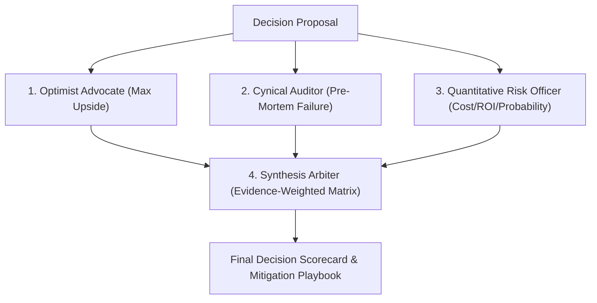

# Decision Council

## Invocation Matrix

| Trigger | Mode | Input Arguments | Deterministic Action |
| :--- | :--- | :--- | :--- |
| `decision council` / `决策委员会` / `压力测试` | Adversarial Stress-Test | Decision proposal or strategic plan | Run 4-agent independent review; compute failure modes; emit synthesis scorecard |

---

## 4-Agent Adversarial Framework



1. **Agent 1: Optimist Advocate**: Explores maximum upside, asymmetric payoffs, and catalyst accelerations.
2. **Agent 2: Cynical Auditor**: Pre-mortem failure analysis, hidden fragility, conflict of interest, and tail risks.
3. **Agent 3: Quantitative Risk Officer**: Probability calibrations, opportunity costs, and break-even timelines.
4. **Agent 4: Synthesis Arbiter**: Evidence-weighted synthesis matrix with go/no-go recommendation and mitigation triggers.

---

## Invariants & Operational Boundaries

1. **Independent Mandates**: Subagents must evaluate the proposal from their dedicated perspective without compromise.
2. **Probabilistic Calibration**: All risk scenarios must assign explicit probability bands (`<10%`, `30-50%`, `>80%`).
3. **Actionable Tripwires**: Output must define explicit condition-based pivot thresholds.

---

## Runnable Input/Output Contract

### Input
```text
decision council: Should I quit my full-time job to sell custom audiobooks on Xianyu?
```

### Output Payload
```markdown
# Decision Council Scorecard

### 1. Adversarial Audit Matrix
- **Optimist Advocate**: Asymmetric upside in building a proprietary automation pipeline and audience asset.
- **Cynical Auditor**: Platform policy risks, copyright enforcement exposure, customer acquisition ceiling.
- **Quantitative Risk Officer**: Expected break-even runway: 6 months; required monthly gross: ¥15,000.

### 2. Synthesis Recommendation
- **Verdict**: CONDITIONAL GO (Part-time incubation first; quit only after achieving 3 consecutive months of 1.5x salary).
- **P0 Tripwire**: If platform flags listing for copyright review, immediately transition to white-label domain sales.
```

---

## Acceptance Criteria

1. **Failure Mode Discovery**: Identifies >=3 non-obvious failure modes before endorsing any strategic decision.
2. **Execution Clarity**: Delivers unambiguous go/no-go conditions and tripwire triggers.
