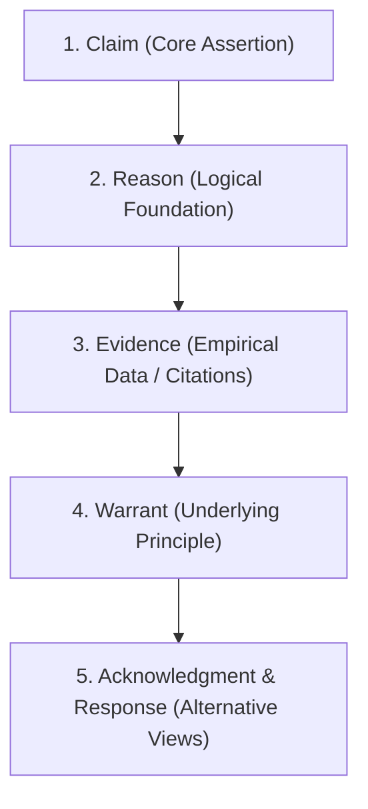

# Research Guide: Evidence Chain & Argumentation Auditor

## Invocation Matrix

| Trigger | Mode | Input Arguments | Deterministic Action |
| :--- | :--- | :--- | :--- |
| `research:` / `研究顾问` / `证据核查` | Argumentation Audit | Research paper, thesis, or claim | Audit 5 elements of argumentation (Claim, Reason, Evidence, Response, Warrant); verify primary sources |

---

## 5-Element Argumentation Architecture



1. **Claim**: Is the core thesis specific, substantive, and contestable?
2. **Reasons**: Are the supporting arguments logically connected to the central claim?
3. **Evidence**: Is the empirical data sufficient, representative, and verifiable from primary sources?
4. **Warrant**: What general principle connects the reason to the claim? Is it valid in this context?
5. **Acknowledgment & Response**: Does the argument anticipate and refute serious counter-evidence?

---

## Invariants & Operational Boundaries

1. **Primary Source Verification**: Prioritize peer-reviewed literature, raw empirical data, and official documentation over secondary blog posts.
2. **Distinguish Reason vs Evidence**: Never accept theoretical reasons as empirical evidence without data grounding.
3. **Warrant Validation**: Flag unstated warrants that fail under edge conditions.

---

## Runnable Input/Output Contract

### Input
```text
research: Remote work permanently decreases company innovation because informal hallway serendipity is lost.
```

### Output Payload
```markdown
# Research Architecture Audit

### 1. Argument Decomposition
- **Claim**: Remote work permanently reduces innovation capacity.
- **Reason**: Physical proximity drives spontaneous cross-disciplinary interactions.
- **Evidence Gap**: Cited evidence relies on pre-2020 in-person workplace studies; lacks empirical data comparing asynchronous digital innovation platforms.
- **Unstated Warrant**: Assumes serendipitous physical encounters are the primary driver of patentable innovation.

### 2. Acknowledgment & Refutation
- Counter-evidence: Stanford WFH studies (Bloom et al.) show individual output increases, but cross-team collaboration networks become more siloed over 12+ month horizons.
```

---

## Acceptance Criteria

1. **Completeness**: Evaluates all 5 dimensions of argumentation for every target claim.
2. **Source Integrity**: Identifies missing primary source evidence with specific empirical requirements.
