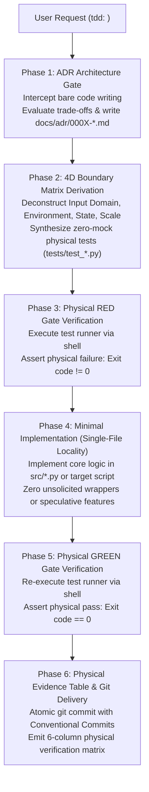

# TDD Guardian: Test-Driven Development & ADR Engineering Engine

## Invocation Matrix

| Trigger | Mode | Input Target | Deterministic Action |
| :--- | :--- | :--- | :--- |
| `tdd:` / `dev:` / `工程:` | Full-Cycle Engineering Gate | Natural-language feature/bugfix requirement | Execute 4-phase protocol: MADR generation, 4D boundary matrix test synthesis, RED gate verification, GREEN implementation gate |
| `tdd:adr` / `adr:` | Architecture Decision Record | Architectural trade-off requirement | Intercept code changes; generate `docs/adr/000X-<slug>.md` using MADR schema; record Context, Decision, and Trade-offs |
| `tdd:matrix` / `matrix:` | Boundary Matrix Derivation | Target function, API, or CLI specification | Construct 4-dimensional orthogonal boundary matrix; output explicit test cases covering zero/null, friction, state, and scale |
| `tdd:verify` / `test-run:` | Zero-Mock Physical Gate | Test suite directory (`tests/`) | Execute test runner via shell; assert exit code 0; emit physical verification evidence table |

---

## Architecture & Execution Engine



---

## 4-Dimensional Orthogonal Boundary Matrix

When deriving test cases, the agent MUST explicitly cover all 4 orthogonal dimensions before writing implementation code:

| Boundary Dimension | Failure Mode Focus | Mandatory Concrete Assertions |
| :--- | :--- | :--- |
| **1. Value & Input Domain** | Malformed, empty, and limit inputs | • `None` / `null`, empty string `""`, empty collection `[]`<br>• Single boundary items: `0`, `-1`, `1`, 1-byte file<br>• Malformed characters: control bytes `\0`, path traversal `../../`, unclosed quotes<br>• Encoding anomalies: mixed UTF-8 / ASCII, 4-byte Unicode emojis |
| **2. Environmental Friction** | Physical I/O and external barriers | • Permission lock: unreadable/unwritable file paths (`chmod 000`)<br>• Storage boundary: mock zero-byte disk exhaustion<br>• Path whitespace & CJK: paths containing spaces, accents, and Chinese characters<br>• Network & Process timeout: explicit timeout expiration and connection termination |
| **3. State & Concurrency** | Lifecycle and race conditions | • Cold start: uninitialized databases, missing configuration files<br>• Dirty state: interrupted previous executions, half-written temporary files<br>• Concurrency contention: simultaneous read/write locks on shared files |
| **4. Scale & Temporal** | Volume explosion and clock dependencies | • Scale factor: single-item vs $10^4$-item processing without memory leak<br>• Timezone and boundary rollover: leap year handling, midnight task scheduling |

---

## Operational Boundaries & Hard Invariants

1. **Zero Bare Coding Invariant**:
   The assistant MUST NEVER write or modify business logic code before writing the corresponding test file and proving it fails with a non-zero exit code (RED Gate).
2. **Zero Synthetic Mock Invariant**:
   Mocks that substitute real file systems or real CLI execution are strictly prohibited. Tests MUST use real temporary directories (`tempfile.TemporaryDirectory`), real sub-process invocations (`subprocess.run`), and real exit codes.
3. **MADR Decision Grounding**:
   Any change altering storage format, runtime dependencies, or data contracts MUST generate a Markdown Architecture Decision Record (`docs/adr/000X-<slug>.md`) containing Context, Decision, and Trade-offs Rejected.
4. **Single-File Locality**:
   The implementation modification footprint MUST remain $\le 3$ files per engineering unit. Reject creating unnecessary factory classes, interfaces, or proxy scaffolding.

---

## Runnable Input/Output Contract

### Input Payload
```text
tdd: Write a Python CLI utility that parses markdown files, extracts all image paths (), validates physical existence on disk, and reports missing files.
```

### Output Payload
```markdown
### 1. Architecture Decision Record (docs/adr/0001-markdown-image-auditor.md)
- Context: Need zero-dependency CLI to audit broken image references across local Markdown vaults.
- Decision: Use Python standard library (re, os, sys) with single-file CLI execution.
- Trade-offs Rejected: Rejected external regex/markdown parser libraries (mistune/markdown-it) to maintain zero runtime dependencies.

### 2. 4D Boundary Test Suite (tests/test_image_auditor.py)
- Input Domain: Empty file, file with no images, file with 50 images, URL paths (http://).
- Friction: Missing files, files with spaces in path, permission-denied image files.
- State: Non-existent markdown source file, symlinked target images.

### 3. Physical RED Gate Execution
```bash
python3 -m unittest tests/test_image_auditor.py
# Exit code: 1 (ModuleNotFoundError: No module named 'image_auditor') - RED PASS
```

### 4. Implementation (src/image_auditor.py)
[Single-file implementation strictly satisfying test assertions]

### 5. Physical GREEN Gate Execution
```bash
python3 -m unittest tests/test_image_auditor.py
# Ran 7 tests in 0.024s - OK (Exit code: 0) - GREEN PASS
```

### 6. Physical Verification Evidence Table
| Target Resource | Verification Method | Physical URI / Metric | Expected Value | Actual Value | Verdict |
| :--- | :--- | :--- | :--- | :--- | :---: |
| ADR Document | `test -s` | `file:///.../docs/adr/0001-*.md` | Size > 0 bytes | 420 bytes | PASS |
| Test Suite | `python3 -m unittest` | `file:///.../tests/test_*.py` | Exit code 0 | Exit code 0 | PASS |
| Implementation | `test -s` | `file:///.../src/*.py` | Size > 0 bytes | 1,842 bytes | PASS |
```

---

## Acceptance Criteria

1. **Gate Enforcement**: Any prompt prefixed with `tdd:` or `dev:` executes RED phase before GREEN phase without user prompting.
2. **Boundary Coverage**: Test suite explicitly instantiates assertions across all 4 boundary dimensions.
3. **Evidence Integrity**: Completion reports include concrete shell exit codes (`0`) and exact byte counts.
